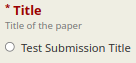
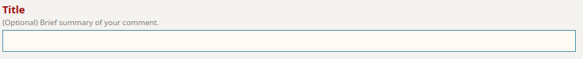
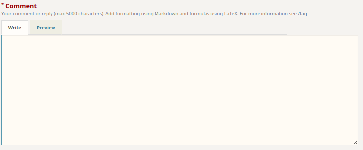
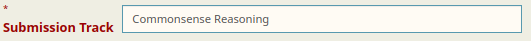
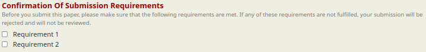
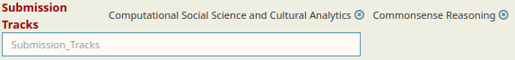
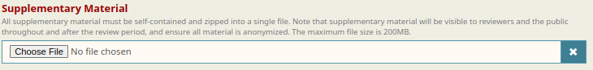

# Customizing Forms

## Introduction and Formatting

Many OpenReview forms are customizable from the different buttons on the venue request form. You can find where to input your customizations by clicking on a button (for example, "**Review Stage**") and finding the large text box under "**Additional \_\_\_\_\_ Options**". Under "**Revision**", you'll find that this box modifies the submission form under the heading "**Additional Submission Options**". For the "**Review Stage**", the heading will be "**Additional Review Form Options**"


Some buttons configure other parts of the workflow that do not have an associated form, in which case there will not be an additional options text box.


These text boxes accept a valid JSON object. The following is an example where the _title_ field gets replaced with a radio button:

```
{
    "title": {
        "order": 1,
        "description": "Title of the paper",
        "value": {
            "param": {
                "type": "string",
                "enum": ["Test Submission Title"],
                "input": "radio"
            }
        }
    }
}
```

<figure><figcaption><p>Preview of how this field will be rendered on OpenReview</p></figcaption></figure>

We can use this example to learn about the general pattern of the different form options.&#x20;

```
{
    "title": {...}
}
```

First, the outermost key is always the name of the field.

```
{
    "title": {
        "order": 1,
        "description": "Title of the paper",
        "value": {...}
    }
}
```

One level below, we find the keys `order` and `description`. These are _representation specifiers_ and they are used to define the formatting and design of the field. Generally, these are the only fields you'll find at this level, along with the `value` object.

```
"value": {
    "param": {
        "type": "string",
        "enum": ["Test Submission Title"],
        "input": "radio"
    }
}
```

At this level, you'll also see the `value` object and within it, the `param` object. When making a field that is asking for user input, you will _**always**_ see this pattern of `"value": { "param": {...} }`. Inside the `param` object, you find _validation specifiers_ along with _representation specifiers_.


Both validation and representation specifiers can be found inside the `param` object


Validation specifiers are used by the back-end to allow or disallow data submitted on the form. In this example, only a single string is allowed, and that string must be one of the values defined in the `enum` array. Specifically, a string that has the value "`Test Submission Title`"

### Validation Specifiers

The `type` specifiers supported by the forms are `string`, `string[]` (string array) and `file`.

`string` fields can be simply validated by length using `maxLength` or `minLength`. For example, `"maxLength": 5`, or `"minLength": 5`. If you want the data in this field to follow a more structured pattern, you can also define a `regex`, for example `"regex": "[^;,\n]+(,[^,\n]+)*"`. You can also use `enum` to restrict the user to select a string from a set of strings.

`string[]` fields are generally going to be used with `enum` to allow users to select multiple strings from a set of strings.

`file` fields are specifically validated with `maxSize` and `extensions`. `maxSize` is an integer that specifies the size of the largest file that can be uploaded on the form in megabytes. `extensions` is a list of strings that are extensions, for example `"extensions": ["pdf", "zip"]`.


Extensions that have a "." in them are **not** supported. The following field would be invalid because "`tar.gz`" is not supported:

```
"extensions": ["zip", "tar.gz"]
```


`optional` is a boolean (true/false) value that indicates whether or not this field is required to be present when the form is submitted. Generally, "optional": true is added to the param object to indicate an optional field, and is omitted for required fields. This is because the default behavior is that a field is required.


Required fields have their field names prefixed with an asterisk


### Representation Specifiers

`order` determines the order in which the field is going to be rendered in the form

`description` is a short and brief explanation of what is expected, or any additional information about the field

The following specifiers are defined in the `param` object:

`default` is the value that is going to be shown when the widget is initialized

`markdown` is a boolean value that enables markdown for this text field

`scroll` is a boolean that adds a scroll bar to a `textarea` input

The `input` specifier determines the rendering on the form and can have the following values:&#x20;

* `text`
* `select`
* `checkbox`
* `textarea`
* `radio`

How these each affect a field are best shown below in some common form patterns

## Examples of Common Form Patterns

### Text Input



```
{
  "title": {
    "order": 1,
    "description": "(Optional) Brief summary of your comment.",
    "value": {
      "param": {
        "type": "string",
        "maxLength": 500,
        "optional": true
      }
    }
  }
}
```

<figure><figcaption></figcaption></figure>



```
{
  "comment": {
    "order": 2,
    "description": "Your comment or reply (max 5000 characters). Add formatting using Markdown and formulas using LaTeX. For more information see https://openreview.net/faq",
    "value": {
      "param": {
        "type": "string",
        "maxLength": 5000,
        "markdown": true,
        "input": "textarea"
      }
    }
  }
}
```

<figure><figcaption></figcaption></figure>



### Single Choice



```
{
  "recommendation": {
    "order": 10,
    "description": "Please provide your recommendation based on the manuscript, reviews, author responses and your discussion with the reviewers.",
    "value": {
      "param": {
        "type": "string",
        "enum": [
          "Reject",
          "Accept",
          "Nominate for best paper"
        ],
        "input": "radio"
      }
    }
  }
}
```

<figure><figcaption></figcaption></figure>



```
{
  "submission_track": {
    "order": 11,
    "description": "Please select a preferred track, which will be considered in the paper-reviewer assignment. Please note that your choice of a track will be taken into account, but the chairs may decide to move your paper to a different area when appropriate.",
    "value": {
      "param": {
        "type": "string",
        "enum": [
          "Commonsense Reasoning",
          "Computational Social Science and Cultural Analytics",
          "Dialogue and Interactive Systems",
          "Discourse and Pragmatics",
          "Efficient Methods for NLP",
          "Ethics in NLP",
          "Human-Centered NLP",
          "Information Extraction",
          "Information Retrieval and Text Mining",
          "Interpretability, Interactivity, and Analysis of Models for NLP",
          "Language Grounding to Vision, Robotics and Beyond",
          "Language Modeling and Analysis of Language Models",
          "Linguistic Theories, Cognitive Modeling, and Psycholinguistics",
          "Machine Learning for NLP",
          "Machine Translation",
          "Multilinguality and Linguistic Diversity",
          "Natural Language Generation",
          "NLP Applications",
          "Phonology, Morphology, and Word Segmentation",
          "Question Answering",
          "Resources and Evaluation",
          "Semantics: Lexical",
          "Semantics: Lexical, Sentence level, Document Level, Textual Inference, etc.",
          "Sentiment Analysis, Stylistic Analysis, and Argument Mining",
          "Speech and Multimodality",
          "Summarization",
          "Syntax, Parsing and their Applications",
          "Theme Track: Large Language Models and the Future of NLP"
        ],
        "input": "select"
      }
    }
  }
}
```

<figure><figcaption></figcaption></figure>



### Multiple Choices



```
{
  "confirmation_of_submission_requirements": {
    "order": 17,
    "description": "Before you submit this paper, please make sure that the following requirements are met. If any of these requirements are not fulfilled, your submission will be rejected and will not be reviewed.",
    "value": {
      "param": {
        "type": "string[]",
        "optional": true,
        "enum": [
          "Requirement 1",
          "Requirement 2"
        ],
        "input": "checkbox"
      }
    }
  }
}
```

<figure><figcaption></figcaption></figure>



```
{
  "submission_tracks": {
    "order": 11,
    "description": "Please select your preferred tracks, which will be considered in the paper-reviewer assignment. Please note that your choice of tracks will be taken into account, but the chairs may decide to move your paper to a different area when appropriate.",
    "value": {
      "param": {
        "type": "string[]",
        "enum": [
          "Commonsense Reasoning",
          "Computational Social Science and Cultural Analytics",
          "Dialogue and Interactive Systems",
          "Discourse and Pragmatics",
          "Efficient Methods for NLP",
          "Ethics in NLP",
          "Human-Centered NLP",
          "Information Extraction",
          "Information Retrieval and Text Mining",
          "Interpretability, Interactivity, and Analysis of Models for NLP",
          "Language Grounding to Vision, Robotics and Beyond",
          "Language Modeling and Analysis of Language Models",
          "Linguistic Theories, Cognitive Modeling, and Psycholinguistics",
          "Machine Learning for NLP",
          "Machine Translation",
          "Multilinguality and Linguistic Diversity",
          "Natural Language Generation",
          "NLP Applications",
          "Phonology, Morphology, and Word Segmentation",
          "Question Answering",
          "Resources and Evaluation",
          "Semantics: Lexical",
          "Semantics: Lexical, Sentence level, Document Level, Textual Inference, etc.",
          "Sentiment Analysis, Stylistic Analysis, and Argument Mining",
          "Speech and Multimodality",
          "Summarization",
          "Syntax, Parsing and their Applications",
          "Theme Track: Large Language Models and the Future of NLP"
        ],
        "input": "select"
      }
    }
  }
}
```

<figure><figcaption></figcaption></figure>



### Miscellaneous



```
{
  "supplementary_material": {
    "order": 10,
    "description": "All supplementary material must be self-contained and zipped into a single file. Note that supplementary material will be visible to reviewers and the public throughout and after the review period, and ensure all material is anonymized. The maximum file size is 200MB.",
    "value": {
      "param": {
        "type": "file",
        "extensions": [
          "zip",
          "pdf",
          "tgz",
          "gz"
        ],
        "maxSize": 200,
        "optional": true
      }
    }
  }
}
```

<figure><figcaption></figcaption></figure>



### Setting the Readers of a Field

If you want to limit who in the committee can see a particular field in a form, this is done by adding a `readers` field. Please follow this link for more detailed information on [hiding or revealing fields](../how-to-guides/submissions-comments-reviews-and-decisions/how-to-hide-reveal-fields.md). Below are two examples, one for the [submission form](hosting-a-venue-on-openreview/customizing-your-submission-form.md) and one for the meta review form. Notice the different use of dollar sign notation. The notation used for the meta review form will also work for other replies to the forum: reviews, comments, and decisions.



```
{
  "supplementary_material": {
    "order": 10,
    "description": "All supplementary material must be self-contained and zipped into a single file. Note that supplementary material will be visible to reviewers and the public throughout and after the review period, and ensure all material is anonymized. The maximum file size is 200MB.",
    "value": {
      "param": {
        "type": "file",
        "extensions": [
          "zip",
          "pdf",
          "tgz",
          "gz"
        ],
        "maxSize": 200,
        "optional": true
      }
    },
    "readers": [
    "Your/Venue/ID/Program_Chairs",
    "Your/Venue/ID/Submission${4/number}/Senior_Area_Chairs",
    "Your/Venue/ID/Submission${4/number}/Authors"
    ]
  }
}
```



```
{
  "recommendation": {
    "order": 10,
    "description": "Please provide your recommendation based on the manuscript, reviews, author responses and your discussion with the reviewers.",
    "value": {
      "param": {
        "type": "string",
        "enum": [
          "Accept (Oral)",
          "Accept (Poster)",
          "Reject"
        ],
        "input": "radio"
      }
    },
    "readers": [
    "Your/Venue/ID/Program_Chairs",
    "Your/Venue/ID/Submission${7/content/noteNumber/value}/Area_Chairs",
    "Your/Venue/ID/Submission${7/content/noteNumber/value}/Reviewers"
  ]
  }
}
```


