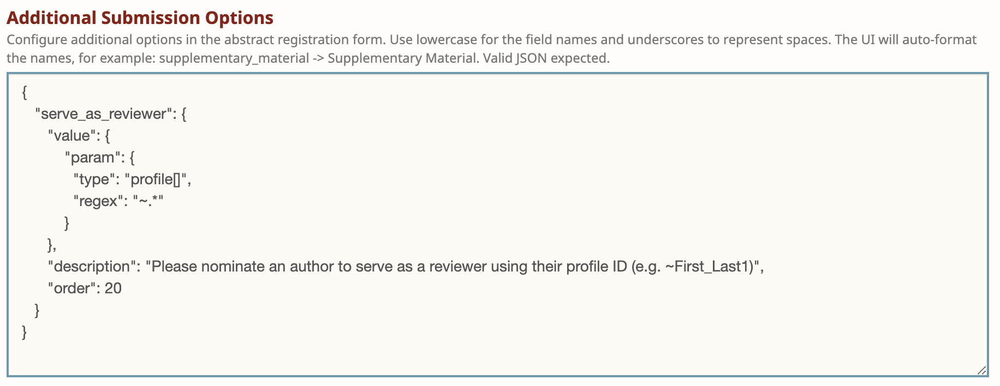

# How to run a paper matching

In order to automatically assign Reviewers and Area Chairs, you must:

1. Enable the 'Review' or 'Post Submission' stage from your venue request form. This can only be done AFTER the submission deadline has passed.&#x20;
2. Use the 'Paper Matching Setup' button on your venue request form to [calculate affinity scores and conflicts.](how-to-setup-paper-matching-by-calculating-affinity-scores-and-conflicts.md)

After you complete these steps, a link for 'Paper Assignments' should appear on your Program Chair console.



Clicking on one of the assignment links will bring you to the assignment page, where you can create a new matching configuration. If members of your reviewer or area chairs group have profiles without publications, you will need to select ‘Yes’ for ‘Allow Zero Score Assignments’ in order to obtain a solution. Please note that all members of a group must have OpenReview profiles in order for the automatic assignment algorithm to run. Any members without profiles must be removed from the group before this step.

You can learn more about our automatic paper matching algorithm from its github repo: https://github.com/openreview/openreview-matcher. To create a new matching, click the 'New Assignment Configuration'. This will pull up a form with some default values pertaining to your matching settings:

User demand: The number of users that should be assigned to each paper

Max papers: The maximum number of papers that can be assigned to each reviewer

Min papers: The minimum number of papers that can be assigned to each reviewer

Scores specification: JSON providing further details and customization to scores, as in the following example:

```
{
    "Example_Venue/2022/Conference/Reviewers/-/Affinity_Score": {
        "weight": 1,
        "default": 0
    },
    "Example_Venue/2022/Conference/Reviewers/-/Bid": {
        "weight": 1,
        "default": 0,
        "translate_map": {
            "Very High": 1,
            "High": 0.75,
            "Neutral": 0,
            "Low": -0.5,
            "Very Low": -1
        }
    }
}
```

Each key represents an edge invitation (affinity score, bid, etc.). Weight can be added to a given score value with the numerical field 'Weight'. 'Default' is a numerical value that is used when there is not an edge for a specific reviewer-paper pair. Finally, 'translate\_map' is a map function that translates an edge label value into a number.

In the example above, the aggregate score being used by the optimizer is: weight \* (affinity score) + weight \* (translate\_map(bid))

After filling out this form and hitting submit, you should see the following:

.png>)

You can view, edit or copy the values you filled out in the matching form. When you are happy with it, you should hit 'Run Matcher' and wait until its status is 'Complete'. This generates proposed assignments, with options to browse assignments, view statistics or deploy matching. If you click ‘Browse Assignments’ you will be brought to the edge browser, where you can browse, edit, and create proposed assignments.
