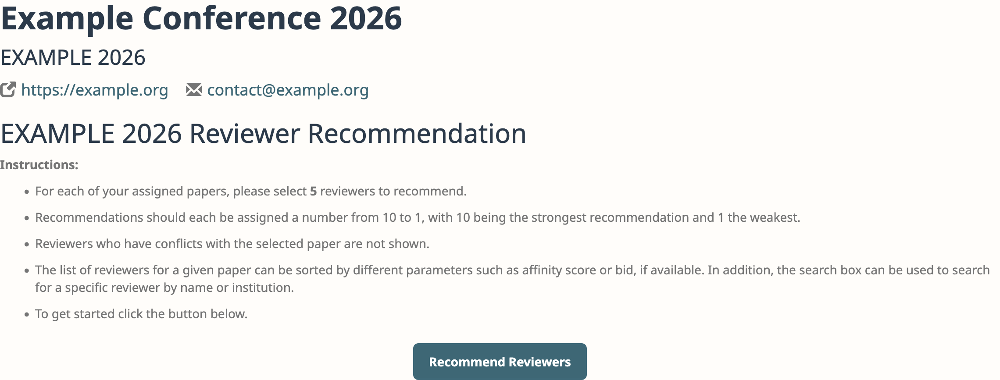
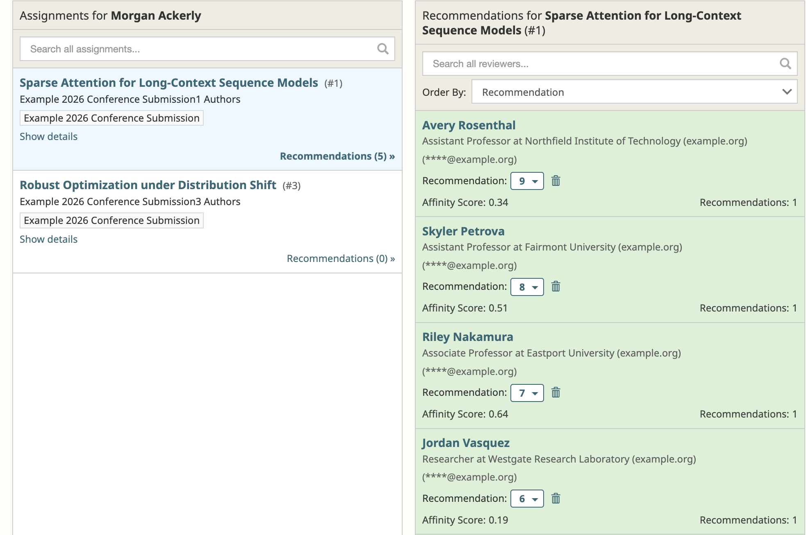

# How to Enable Reviewer Recommendations for Area Chairs

## What gets created

## What Area Chairs see

<figure><figcaption>
The instructions page as an Area Chair sees it. The number of Reviewers to recommend is the value set when the stage was opened.
</figcaption></figure>

<figure><figcaption>
Recommending Reviewers for a submission. Recommended Reviewers are highlighted and show the score the Area Chair gave them.
</figcaption></figure>

## Using recommendations in paper matching

## Tracking progress
