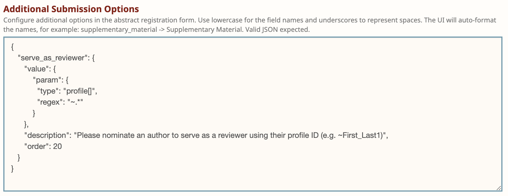

# How to Update a Reviewer's Custom Max Papers

Reviewers have the option to submit a form requesting a custom number of papers to review. The range of this custom number is defined by the organizers of the venue. Reviewers can set this vale during the recruitment period by submitting a form that creates a Note with the Invitation \<your\_venue\_id>/Reviewers/-/Recruitment. When paper matching setup is run, this note is converted to an Edge with the Invitation \<your\_venue\_id>/Reviewers/-/Custom\_Max\_Papers.&#x20;

**To create a reviewers' Custom Max Papers after having run Paper Matching Setup, you can do the following:**

1. If you have not done so, you will need to [install and instantiate the openreview-py client](../../getting-started/using-the-api/installing-and-instantiating-the-python-client.md).&#x20;
2. Create an Edge object with proper params as in the example below:


Creating an Edge varies depending on the API version you are using.

For API V1 use `openreview.Edge`

For API V2 use `openreview.api.Edge`


```python
# This example works for API V2
client.post_edge(openreview.api.Edge(
    invitation='<your_venue_id>/Reviewers/-/Custom_Max_Papers',
    head='<your_venue_id>/Reviewers',
    tail='~Reviewer_ICMLOne1',
    signatures=['<your_venue_id>/Program_Chairs'],
    weight=2
))
```

Please make sure the tail value is the profile id of the user. To get the profile id you can use the following call:

```python
profile = openreview.tools.get_profile('reviewer@icml.cc')
profile.id
```

**To change a reviewers' Custom Max Papers after having run Paper Matching Setup, you can do the following:**

1. If you have not done so, you will need to [install and instantiate the openreview-py client](../../getting-started/using-the-api/installing-and-instantiating-the-python-client.md).&#x20;
2. Retrieve the custom max papers edge for the reviewer. This edge will have the invitation \<your\_venue\_id>/Reviewers/-/Custom\_Max\_Papers and the reviewer's profile ID as its tail, so you can retrieve it like so:&#x20;

```python
edges = client.get_edges(
    invitation="<your_venue_id>/Reviewers/-/Custom_Max_Papers",
    tail="~User_One1"
)
custom_max_papers_edge = edges[0]
```

The edge has a "weight" field. This represents the custom amount of papers they have agreed to review. To change it, you can set it to the new desired number of papers and repost the Edge.&#x20;

```python
custom_max_papers_edge.weight = 2
client.post_edge(custom_max_papers_edge)
```

Once the edge is posted, it will appear in the reviewers console as the following image:

<figure><figcaption><p>Reviewer Console</p></figcaption></figure>
