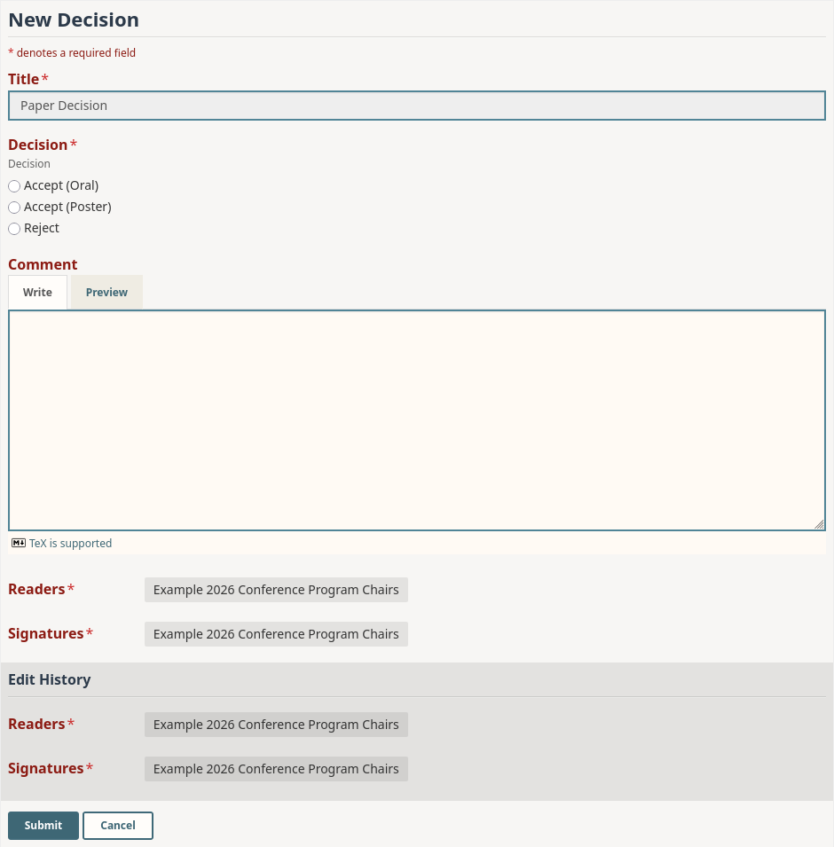

# Default Decision Form

#### API V2 JSON

```json
{
  "title": {
    "order": 1,
    "value": "Paper Decision"
  },
  "decision": {
    "order": 2,
    "description": "Decision",
    "value": {
      "param": {
        "type": "string",
        "enum": [
          "Accept (Oral)",
          "Accept (Poster)",
          "Reject"
        ],
        "input": "select"
      }
    }
  },
  "comment": {
    "order": 3,
    "description": "",
    "value": {
      "param": {
        "type": "string",
        "minLength": 1,
        "maxLength": 5000,
        "input": "textarea",
        "optional": true,
        "deletable": true
      }
    } 
  }
}
```

#### API V1 JSON

```json
{
  "title": {
      "order": 1,
      "required": true,
      "value": "Paper Decision"
  },
  "decision": {
      "order": 2,
      "required": true,
      "value-radio": [
          "Accept (Oral)",
          "Accept (Poster)",
          "Reject"
      ],
      "description": "Decision"
  },
  "comment": {
      "order": 3,
      "required": false,
      "value-regex": "[\\S\\s]{0,5000}",
      "description": ""
  }
}
```

**Preview**

<figure><figcaption><p>The default decision form as a program chair sees it.</p></figcaption></figure>
