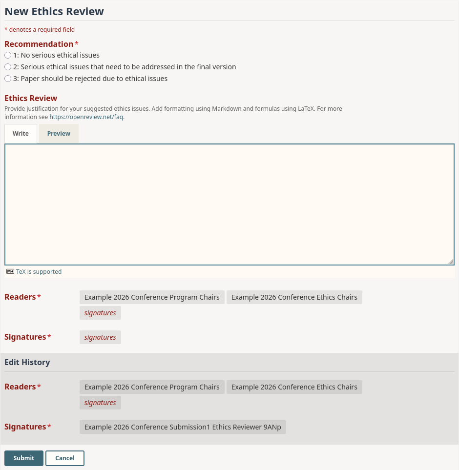

# Default Ethics Review Form

#### API V2 JSON

```json
{
  "recommendation": {
    "order": 1,
    "description": "Please select your ethical recommendation",
    "value": {
      "param": {
        "type": "string",
        "enum": [
          "1: No serious ethical issues",
          "2: Serious ethical issues that need to be addressed in the final version",
          "3: Paper should be rejected due to ethical issues"
        ],
        "input": "radio"
      }
    }
  },
  "ethics_concerns": {
    "order": 2,
    "description": "Briefly summarize the ethics concerns.",
    "value": {
      "param": {
        "type": "string",
        "minLength": 1,
        "maxLength": 20000,
        "input": "textarea"
      }
    }
  }
}
```

#### API V1 JSON

```json
{
    "recommendation": {
      "order": 1,
      "value-radio": [
        "1: No serious ethical issues",
        "2: Serious ethical issues that need to be addressed in the final version",
        "3: Paper should be rejected due to ethical issues"
      ],
      "description": "Please select your ethical recommendation",
      "required": true
    },
    "ethics_concerns": {
      "order": 2,
      "value-regex": "[\\S\\s]{1,200000}",
      "description": "Briefly summarize the ethics concerns.",
      "required": true
    }
  }
```

#### Preview

<figure><figcaption><p>The default ethics review form as an ethics reviewer sees it.</p></figcaption></figure>
