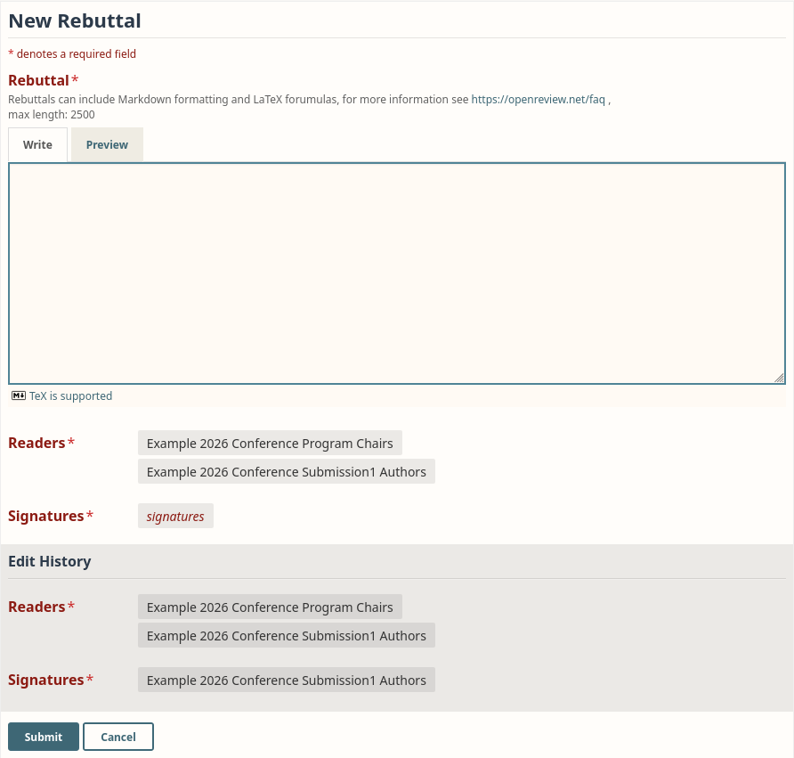

# Default Rebuttal Form

**API V2 JSON**

```json
{
    "rebuttal": {
        "order": 1,
        "description": "Rebuttals can include Markdown formatting and LaTeX forumulas, for more information see https://openreview.net/faq , max length: 2500",
        "value": {
            "param": {
                "type": "string",
                "maxLength": 2500,
                "markdown": true,
                "input": "textarea"
            }
        }
    }
}
```

**Preview**

<figure><figcaption><p>The default rebuttal form as an author sees it.</p></figcaption></figure>
