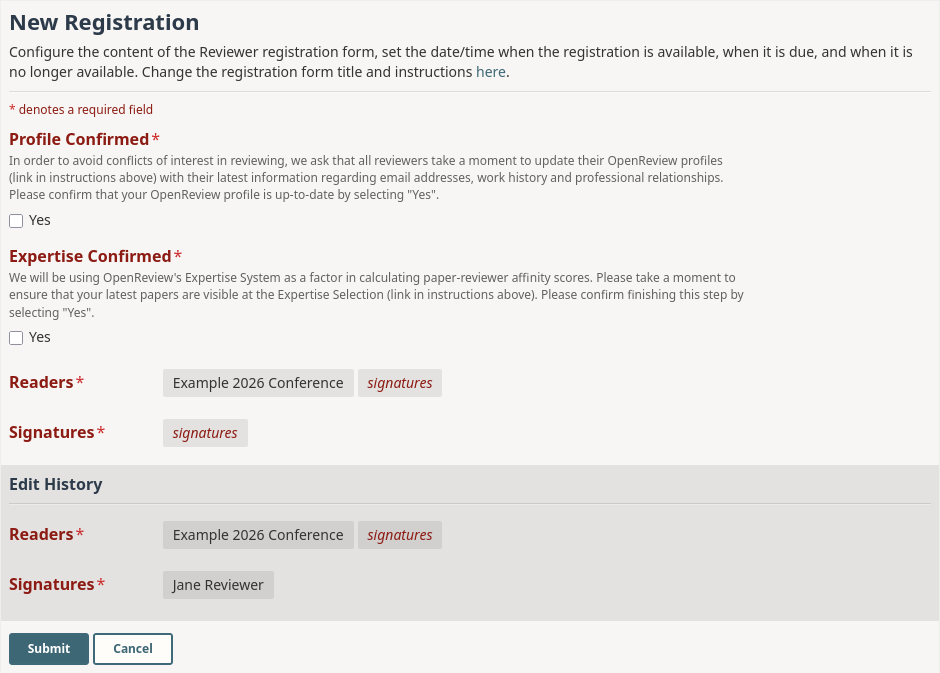

# Default Registration Form

**API V2 JSON**

```json
{
    "profile_confirmed": {
        "description": "In order to avoid conflicts of interest in reviewing, we ask that all reviewers take a moment to update their OpenReview profiles (link in instructions above) with their latest information regarding email addresses, work history and professional relationships. Please confirm that your OpenReview profile is up-to-date by selecting 'Yes'".,
        "value": {
            "param": {
                "type": "string",
                "enum": ["Yes"],
                "input": "checkbox"
            }
        },
        "order": 1
    },
    "expertise_confirmed": {
        "description": "We will be using OpenReview's Expertise System as a factor in calculating paper-reviewer affinity scores. Please take a moment to ensure that your latest papers are visible at the Expertise Selection (link in instructions above). Please confirm finishing this step by selecting 'Yes'.",
        "value": {
            "param": {
                "type": "string",
                "enum": ["Yes"],
                "input": "checkbox"
            }
        },
        "order": 2
    }
}
```

<figure><figcaption><p>The default registration form as a reviewer sees it.</p></figcaption></figure>
